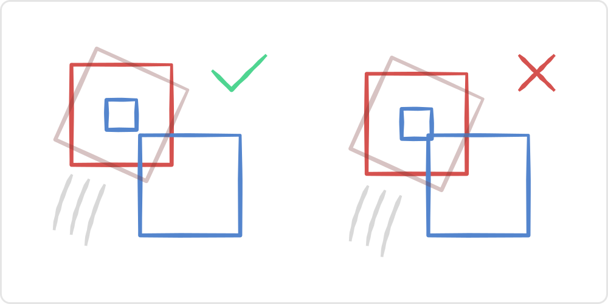
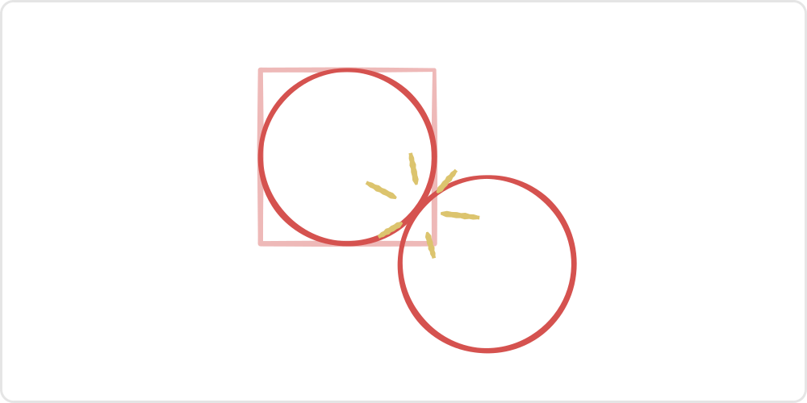
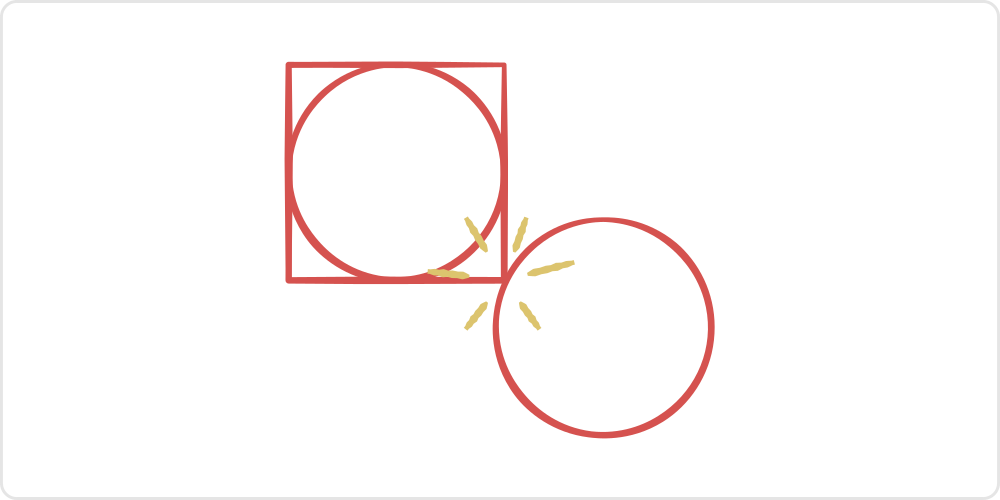

# Player hitboxes
This page covers the **4 player hitboxes** (outer, inner, oriented, and circular).

## Base hitbox sizes
|        | **Cube** | **Ship** | **Ball** | **Wave** | **UFO** | **Robot** | **Spider** | **Swing** |
|--------|----------|----------|----------|----------|---------|-----------|------------|-----------|
| Points | 30       | 30       | 30       | 10       | 30      | 30        | 27         | 30        |
| Blocks | 1        | 1        | 1        | 1/3      | 1       | 1         | 0.9        | 1         |

## Mini portal modifier
In mini mode, the player's hitbox size is multiplied by the PlayerObject member variable `playerScale_`, which is `0.6` (`m_vehicleSize` in the Geode SDK).

## Block inset modifier
The block inset modifier, a.k.a. the *"blue hitbox"*, is a **constant that is applied to the base hitbox size**. It appears in RobTop's code as:
```cpp
#define kBlockInset 0.3f
```
So the player's inner hitbox is always smaller by a multiplier of 0.3. It's used for wall and ceiling collisions in Classic mode. When it collides with any solid or hazard object, both players die immediately.


## Oriented hitbox
The third hitbox on the player follows its orientation instead of being locked onto the grid.

### How an oriented hitbox is determined
The game marks an object as "oriented" if the following conditions are true:
```
1. The object is NOT a decoration
2. The object supports free rotation
3. The object's rotation isn't a multiple of 90
4. The object's hitbox isn't circular
```
*Note: the third condition is `(int)getRotation() % 90 != 0` in the game's code, meaning rotation gets truncated before the remainder is calculated, therefore values near 0, such as 0.5, count as "false" even though they're not axis-aligned.*

### Usage
Only if these conditions are true does the game check overlap against the two oriented boxes (player against object) using the [SAT collision algorithm](https://www.google.com/search?q=separating+axis+theorem) instead of [AABB](https://www.google.com/search?q=AABB+collision+algorithm).

## Circular collisions
The player's circular hitbox's diameter is always equal to the size of the outer square hitbox. The physics engine handles collisions in two ways.

### When the "Fix Radius Collision" legacy option is enabled
Overlap is tested using the **player's circular hitbox** and the **object's circular hitbox**. This level setting is enabled by default in 2.2 levels.


### When disabled
Overlap is tested using the **player's axis-aligned hitbox** and the **object's circular hitbox**. Pre-2.2 levels have this unchecked.


## Related decompilations
- [GJBaseGameLayer::collisionCheckObjects](https://github.com/StarryDawn72/open-source-gd-project/blob/main/src/GJBaseGameLayer/collisionCheckObjects.cpp) handles behavior for every object type on player collision.
- [GJBaseGameLayer::playerCircleCollision](https://github.com/StarryDawn72/open-source-gd-project/blob/main/src/GJBaseGameLayer/playerCircleCollision.cpp) main function where all circular collisions are resolved.
- [GJBaseGameLayer::objectIntersectsCircle](https://github.com/StarryDawn72/open-source-gd-project/blob/main/src/GJBaseGameLayer/objectIntersectsCircle.cpp) used by pre-2.2 levels.
- [GJBaseGameLayer::playerIntersectsCircle](https://github.com/StarryDawn72/open-source-gd-project/blob/main/src/GJBaseGameLayer/playerIntersectsCircle.cpp) used by post-2.2 levels.